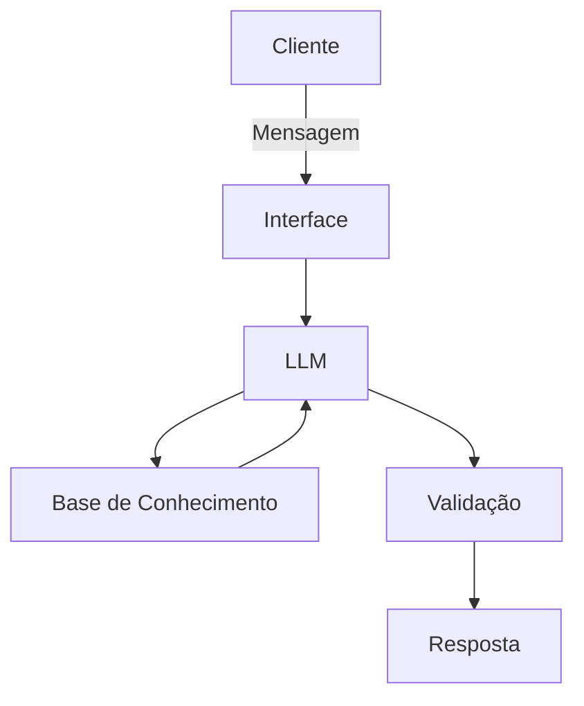

# Documentação do Agente

## Caso de Uso

### Problema
> Qual problema financeiro seu agente resolve?

[Sua descrição aqui]

### Solução
> Como o agente resolve esse problema de forma proativa?

[Sua descrição aqui]

### Público-Alvo
> Quem vai usar esse agente?

[Sua descrição aqui]

### Rascunho provisório
A maioria dos clientes realiza uma gestão financeira puramente reativa, analisando extratos apenas quando o mês já acabou ou quando a conta entra no vermelho. O problema central é a incapacidade de prever a **saturação do orçamento** em tempo real e a dificuldade em detectar **anomalias sutis de gastos** (como assinaturas com reajustes silenciosos, cobranças duplicadas ou picos de consumo em categorias específicas) antes que comprometam a liquidez do mês.
O agente atua como um sistema de monitoramento preditivo para a saúde financeira do cliente. Ao invés de esperar uma pergunta, ele analisa o histórico de transações continuamente para estabelecer um padrão basal de consumo. Se o algoritmo detectar uma anomalia nos gastos diários ou projetar matematicamente que uma categoria do orçamento atingirá a saturação antes do previsto, o agente aciona o cliente proativamente. Ele enviará um alerta claro diagnosticando o desvio e cocriará planos de ação imediatos (ex: sugerir a pausa temporária de um serviço específico ou o remanejamento de limites), garantindo que os objetivos de economia sejam atingidos com eficácia.
Profissionais autônomos, freelancers e trabalhadores do setor de tecnologia que possuem dinâmicas de renda mais flexíveis ou variáveis. É um público que valoriza a automação, toma decisões baseadas em dados e precisa de ferramentas que minimizem o trabalho manual de classificar despesas e vigiar planilhas de fluxo de caixa constantemente.
---

## Persona e Tom de Voz

### Nome do Agente
[Nome escolhido]

### Personalidade
> Como o agente se comporta? (ex: consultivo, direto, educativo)

[Sua descrição aqui]

### Tom de Comunicação
> Formal, informal, técnico, acessível?

[Sua descrição aqui]

### Exemplos de Linguagem
- Saudação: [ex: "Olá! Como posso ajudar com suas finanças hoje?"]
- Confirmação: [ex: "Entendi! Deixa eu verificar isso para você."]
- Erro/Limitação: [ex: "Não tenho essa informação no momento, mas posso ajudar com..."]

---

## Arquitetura

### Diagrama

### Componentes

| Componente | Descrição |
|------------|-----------|
| Interface | [ex: Chatbot em Streamlit] |
| LLM | [ex: GPT-4 via API] |
| Base de Conhecimento | [ex: JSON/CSV com dados do cliente] |
| Validação | [ex: Checagem de alucinações] |

---

## Segurança e Anti-Alucinação

### Estratégias Adotadas

- [ ] [ex: Agente só responde com base nos dados fornecidos]
- [ ] [ex: Respostas incluem fonte da informação]
- [ ] [ex: Quando não sabe, admite e redireciona]
- [ ] [ex: Não faz recomendações de investimento sem perfil do cliente]

### Limitações Declaradas
> O que o agente NÃO faz?

[Liste aqui as limitações explícitas do agente]